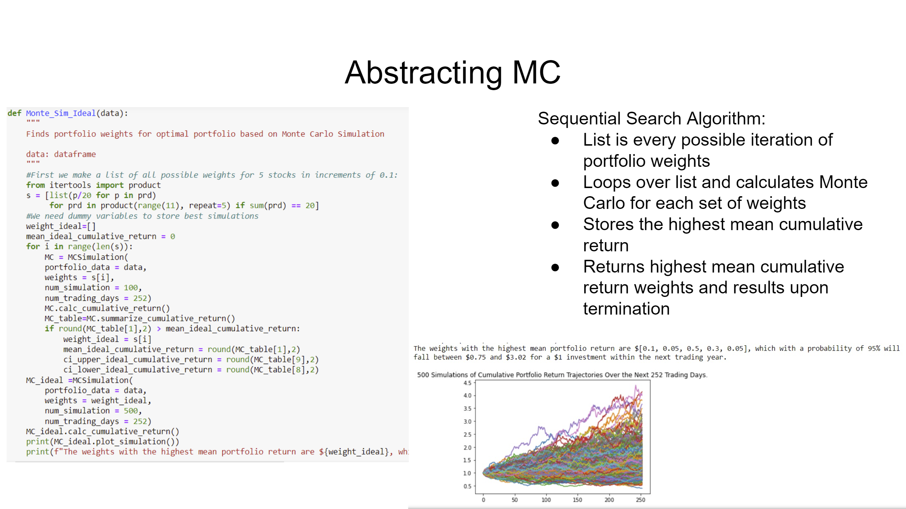
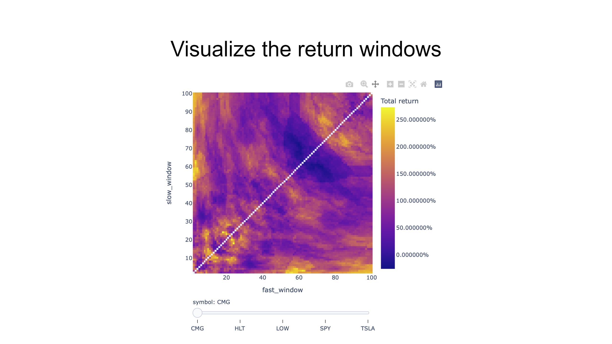

# Stock Analysis and Trading Project

In this Challenge, we assume the role of analysts and traders for a trading firm.

There are 3 notebooks to present our project, which include the following: </br>
a) Quantitative Analysis </br>
b) Monte Carlo Simulation </br>
c) Vector bt trading strategies

We chose four billionaires who invest in the stock market, namely Warren Buffett, Ray Dalio, Cathie Wood and Bill Ackman, and we took their four top stocks, as follows:

**Warren Buffett**
</br>
Apple
</br>
Bank of America
</br>
Coca-Cola
</br>
Chevron
</br>
American Express

**Cathie Wood**
</br>
Tesla Inc.
</br>
Zoom Video Communication - Class A
</br>
Teledoc Health Inc.
</br>
Roku

**Bill Ackmann**
</br>
Lowe's
</br>
Chipotle
</br>
Restaurant Brands international
</br>
Hilton worldwide Holdings Inc.
</br>
Howard Hughes Corporation

**Ray Dalio**
</br>
SPY
</br>
Procter & Gamble
</br>
Vanguard VWO
</br>
Pepsi Co
</br>
Johnson & Johnson
</br>
We chose to reject Roku because it did not have 5 years of data to analyze and Vanguard VWO because it is an emerging markets ETF and we are focused on stocks, but we did include SPY.

Firstly, we will complete the quantitative analysis, which involves analysis of several components: performance, volatility, risk, risk-return profile, and portfolio diversification and we will go through each one individually.

Secondly, we will go through the Monte Carlo simulation and will analyze their future performance based on past practices, through a large set of computational algorithms designed to predict an outcome based on the examination of random variables and their probability distributions.

Monte Carlo simulation is a large set of computational algorithms designed to predict an outcome based on the examination of random variables and their probability distributions.

Monte Carlo is used to predict future prices by noting standard deviation of daily returns and using them to predict next day prices. The model may be projected for a larger amount of time and an assessment of probability of annual returns for a certain portfolio may be inferred. We created a sequential search algorithm which includes the following:

The list is every possible iteration of portfolio weights.
It loops over list and calculates Monte Carlo for each set of weights.
Stores the highest mean cumulative return.
Returns highest mean cumulative return weights and results upon termination.

Thirdly, we will use Vectorbt, a backtesting library that allows us to quickly test a variety of trading strategies and retest our simulations. We will analyze trading the moving average and see if they provide higher returns. We will visualize the return windows with a heat map. We will analyze the buy and sell graphs and look at their cumulative returns. We will analyze 2000 weight combinations and find the best weight group. We will look at the returns and stats on an annual basis. Then, we will examine what will happen if we rebalance our portfolio monthly. We will finally run the Monte Carlo simulation once again.

In the future, we will use machine learning to refine our model, make a strong portfolio, reduce computational load and increase efficiency. We will analyze whether more innovative analysis will change our model and reflect on how we can use forecasting to make a better model.

---

## Technologies

This was developed with Anaconda, which includes Pandas, Matplotlib and Jupyter_Lab and in addition Holoviews and Vectorbt. We created it in a development environment running Python 3.7.13.

---

## Installation Guide

To install the programs to run the program, you have to do the following or you can open the ipynb files in github and attempt to read the file there. There are some issues with Holoviews and you may not be able to view them there.

Install Anaconda and Python. </br>
pip install -U vectorbt
Git clone the repo and run it, pursuant to the following clone address

git clone https://github.com/JeffSmith-ok/Stock_Project

cd Stock_Project

In the terminal type 'Jupyter Lab'

---

## Usage

The following images present important parts of three notebooks.

##  </br>

##  </br>

##  </br>

---

## Contributors

This is the first group project.

Our contact information is:

Name: Russell Moore </br>
https://www.linkedin.com/in/russell-david-moore/
Personal email: rdm5181@gmail.com </br>

Name: Mike Cutno </br>
Linkedin: https://www.linkedin.com/in/mikefree27/ </br>
Personal email: mikecutno@gmail.com </br>

Name: Jeffrey M. Smith </br>
Linkedin: https://www.linkedin.com/in/jeffsmith77/ </br>
Personal email: jmstranslate@gmail.com </br>

---

## License

MIT License

Copyright (c) 2022 Jeffrey M. Smith

Permission is hereby granted, free of charge, to any person obtaining a copy of this software and associated documentation files (the "Software"), to deal in the Software without restriction, including without limitation the rights to use, copy, modify, merge, publish, distribute, sublicense, and/or sell
copies of the Software, and to permit persons to whom the Software is furnished to do so, subject to the following conditions:

The above copyright notice and this permission notice shall be included in all copies or substantial portions of the Software.

THE SOFTWARE IS PROVIDED "AS IS", WITHOUT WARRANTY OF ANY KIND, EXPRESS OR IMPLIED, INCLUDING BUT NOT LIMITED TO THE WARRANTIES OF MERCHANTABILITY, FITNESS FOR A PARTICULAR PURPOSE AND NONINFRINGEMENT. IN NO EVENT SHALL THE AUTHORS OR COPYRIGHT HOLDERS BE LIABLE FOR ANY CLAIM, DAMAGES OR OTHER LIABILITY, WHETHER IN AN ACTION OF CONTRACT, TORT OR OTHERWISE, ARISING FROM, OUT OF OR IN CONNECTION WITH THE SOFTWARE OR THE USE OR OTHER DEALINGS IN THE
SOFTWARE.

```

```
